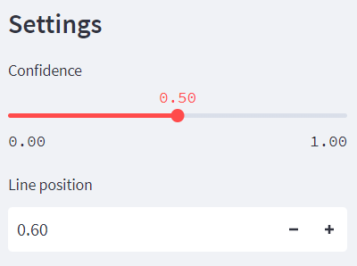

## Installation

* Install essential libraries and packages:
```python
pip install -r requirements.txt
```

* Run demo:
```python
streamlit run demo.py --server.maxUploadSize=500
streamlit run future.py --server.maxUploadSize=700
```

**NOTE**: If the web keeps showing "Please wait...", try to install streamlit version 1.11.0
```python
pip install streamlit==1.11.0
```

If the web shows error "no module easydict"
```python
pip install easydict
```

# DEMO

## Steps:
1. Click ```Browse files``` to input video

2. Setting *Confidence* and *Line position*


* Confidence: the probability that one object belongs to one class

* Line position: the position of green line, any vehicle have coordinate below the line will be counted

3. Click ```START```

## Result


